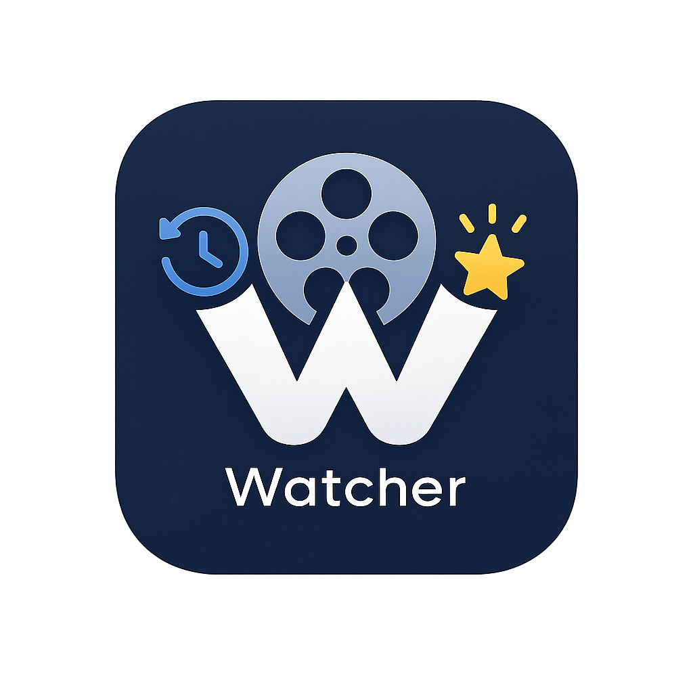

<p align="center">
  <picture>
    <source media="(prefers-color-scheme: dark)" srcset=".github/banner.png">
    
  </picture>
</p>

<p align="center">
  <a href="https://opensource.org/licenses/MIT"></a>
  <a href="#-status"></a>
  <a href="https://www.rust-lang.org"></a>
  <a href="https://v2.tauri.app"></a>
  <a href="https://www.themoviedb.org"></a>
</p>

---

**Watcher** is a personal movie & TV show tracker with local AI-powered recommendations. It uses [Tauri 2](https://v2.tauri.app) (Rust + vanilla web frontend) and runs entirely offline after initial setup — the only network dependency is fetching metadata from [TMDB](https://www.themoviedb.org) and optionally downloading the recommendation model.

Built on a whim for personal use. This space is already crowded with excellent apps, so this is just my take — contributions are welcome if you'd like to spend more time on it.

## Features

- **Track plays** — log when and where you watched a movie or TV episode, with optional star ratings
- **TMDB metadata** — automatic poster, synopsis, credits, keywords, and technical details
- **Watchlist** — maintain a want-to-watch list for movies and TV series
- **Import / Export** — full JSON import/export for portability
- **Local AI recommendations** — describes what you're in the mood for in plain text; a local [BERT](https://huggingface.co/sentence-transformers/all-MiniLM-L6-v2) model ranks TMDB candidates by semantic similarity to your prompt
- **Favourite directors & actors** — boosts recommendations for creators you rate highly
- **Dashboard** — quick stats on total plays, unique titles, favourite media, and top places

## Screenshots

> Coming soon

## Getting Started

### Prerequisites

- Rust toolchain
- A free [TMDB API key](https://www.themoviedb.org/settings/api) (set via `TMDB_API_KEY` environment variable or at build time)

### Build & Run

```bash
# Run in development mode
TMDB_API_KEY=your_key_here cargo run --manifest-path src-tauri/Cargo.toml

# Build a release binary
cargo build --release --manifest-path src-tauri/Cargo.toml

# Build a .deb package
npx tauri build --bundles deb

# Build an AppImage
npx tauri build --bundles appimage
```

Alternatively, use the top-level `Makefile`:

```bash
make deb   # TMDB_API_KEY=your_key_here make deb
make run   # TMDB_API_KEY=your_key_here make run
```

The first launch will download the `all-MiniLM-L6-v2` sentence-transformer model (~90 MB) from HuggingFace Hub. Subsequent launches use the cached copy.

## Status

**Work in progress** — not yet ready for everyday use. Things that are missing or rough:

- The frontend is vanilla HTML/CSS/JS with no reactive framework — functional but minimal
- No packaged distribution beyond `.deb` / AppImage
- The recommendation pipeline is naive: TMDB search + local BERT similarity. Quality varies.
- No push notifications or background sync
- Linux-only at the moment (tested on Ubuntu)

## Built With

- [Tauri 2](https://v2.tauri.app) — desktop application framework
- [TMDB API](https://www.themoviedb.org/documentation/api) — movie & TV metadata
- [Candle](https://github.com/huggingface/candle) — local BERT inference (no GPU required)
- [sentence-transformers/all-MiniLM-L6-v2](https://huggingface.co/sentence-transformers/all-MiniLM-L6-v2) — embedding model
- [tokenizers](https://github.com/huggingface/tokenizers) — HuggingFace tokenizer
- [rusqlite](https://github.com/rusqlite/rusqlite) — SQLite bindings
- [hf-hub](https://crates.io/crates/hf-hub) — model downloading from HuggingFace

## Credits

- **Author / Maintainer:** [BlancoBAM](https://github.com/BlancoBAM)
- All movie and TV metadata is provided by [The Movie Database (TMDB)](https://www.themoviedb.org). This product uses the TMDB API but is not endorsed or certified by TMDB.
- The recommendation model is [sentence-transformers/all-MiniLM-L6-v2](https://huggingface.co/sentence-transformers/all-MiniLM-L6-v2) from HuggingFace, running locally via [Candle](https://github.com/huggingface/candle).

## License

MIT — see [LICENSE](LICENSE) for details.
# Watcher
